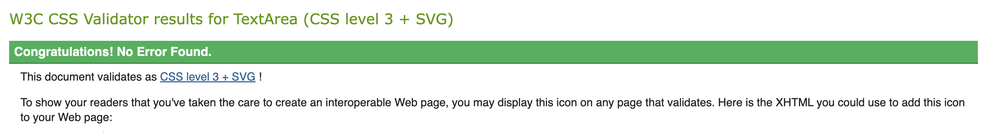

# Rock Paper Scissors
We all played rock paper scissors when we were kids. This game is same like our childhood game but instead of our friend we are playing this game with computer.You will have three choices to pick from Rock , Paper , Scissors. You have to Choose one Choice then computer will choose its choice and if you win you will get one point and it will be displayed on the score board along with the ties and lost.

## Features 
The main Features of the website is when you hoover over buttons, the button colors changes. When you click on button of your choice the computer choice prints out underneath computer choice. 

## Testing
html testing is done in w3 school
css testing is done in w3 school
javascript testing is done in google chrom dev tools and JShint
## Validation
Their is no error in HTML 

their is no error in CSS

## Wireframe

## Color Scheme

### Programming Languages
HTML5

CSS3

Javascript

##  Credits
I took inspiration for button from love Maths project.

